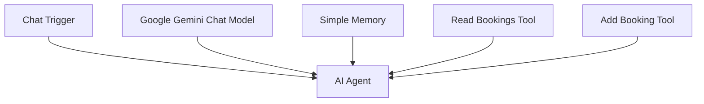
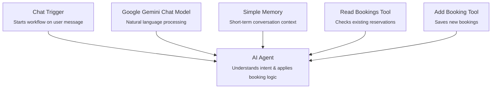

# **workflow-overview.md**

# **Table Booking Bot – Workflow Overview**



---

## **Chat Trigger**

The Chat Trigger starts the workflow whenever a user sends a message. It exposes the webhook URL used by your chat interface and passes the incoming message directly to the AI Agent. Because it is marked as **public** and **availableInChat**, it can be used by the n8n chat widget or any embedded chat interface.

### JSON

```json
{
  "parameters": {
    "public": true,
    "availableInChat": true,
    "options": {}
  },
  "type": "@n8n/n8n-nodes-langchain.chatTrigger",
  "typeVersion": 1.4,
  "position": [0, 0],
  "id": "2fa639be-bb1a-4575-8f4d-e96a7812557c",
  "name": "When chat message received",
  "webhookId": "4d99cc13-5b87-4276-841c-310438e9d7bc"
}
```

---

## **AI Agent**

The AI Agent is the brain of the workflow. It receives the user message from the Chat Trigger, uses the Gemini model to interpret it, and decides whether to read existing bookings or add a new one. The system prompt defines the booking rules, conflict handling, and the structured data the agent must extract.

### JSON

```json
{
  "parameters": {
    "options": {
      "systemMessage": "You are a restaurant booking agent that helps customers book tables.\n\nYour workflow:\n1. When a customer requests a booking, extract: name, date, time, and number of people\n2. Use Read Booking Tool to check existing bookings\n3. Check if the requested date and time already has a booking\n4. If there is a conflict (same date AND time):\n   - DO NOT add the booking\n   - Inform the customer that the time slot is already taken\n   - Ask them to choose another time slot\n5. If there is NO conflict:\n   - Use Add Booking Tool to add the booking\n   - Confirm the booking to the customer\n\nIMPORTANT: NEVER cancel or overwrite existing bookings. If a time slot is taken, politely inform the customer and ask them to select a different time.\n\n\n\n\n"
    }
  },
  "type": "@n8n/n8n-nodes-langchain.agent",
  "typeVersion": 3.1,
  "position": [208, 0],
  "id": "1edf313d-5357-4b5b-819c-28a5c5225859",
  "name": "AI Agent"
}
```

---

## **Google Gemini Chat Model**

This is the language model the AI Agent uses to understand user messages and generate responses. It powers the natural conversation and extracts structured booking details.

### JSON

```json
{
  "parameters": {
    "modelName": "models/gemini-2.5-flash-lite",
    "options": {}
  },
  "type": "@n8n/n8n-nodes-langchain.lmChatGoogleGemini",
  "typeVersion": 1,
  "position": [80, 208],
  "id": "82687fbb-c68d-4363-8e38-8590f15756c3",
  "name": "Google Gemini Chat Model",
  "credentials": {
    "googlePalmApi": {
      "id": "XKNRdGl2bg6uRzQy",
      "name": "Google Gemini(PaLM) Api account"
    }
  }
}
```

---

## **Simple Memory**

This node stores short-term conversational context so the bot can remember details within the same session. It helps the agent maintain continuity when asking follow-up questions.

### JSON

```json
{
  "parameters": {
    "contextWindowLength": 20
  },
  "type": "@n8n/n8n-nodes-langchain.memoryBufferWindow",
  "typeVersion": 1.3,
  "position": [224, 208],
  "id": "abee7fdb-bb6f-42e6-8fb7-6febefa7213c",
  "name": "Simple Memory"
}
```

---

## **Read Bookings Tool**

This tool reads all existing bookings from your Google Sheet. The AI Agent uses it to check for conflicts before adding a new booking. It prevents double-booking and ensures accuracy.

### JSON

```json
{
  "parameters": {
    "descriptionType": "manual",
    "toolDescription": "Use this tool to read all existing bookings from Google Sheet. The sheet has columns: Name, Date, Time, People. Check this before creating a new booking to avoid double bookings.",
    "documentId": {
      "__rl": true,
      "value": "1zVKx7LSMCTQ-YYcROy_gbQQaEelFrIYV06PZqjHRyD0",
      "mode": "list",
      "cachedResultName": "Booking",
      "cachedResultUrl": "https://docs.google.com/spreadsheets/d/1zVKx7LSMCTQ-YYcROy_gbQQaEelFrIYV06PZqjHRyD0/edit?usp=drivesdk"
    },
    "sheetName": {
      "__rl": true,
      "value": "gid=0",
      "mode": "list",
      "cachedResultName": "Sheet1",
      "cachedResultUrl": "https://docs.google.com/spreadsheets/d/1zVKx7LSMCTQ-YYcROy_gbQQaEelFrIYV06PZqjHRyD0/edit#gid=0"
    },
    "options": {}
  },
  "type": "n8n-nodes-base.googleSheetsTool",
  "typeVersion": 4.7,
  "position": [464, 304],
  "id": "7dd9e786-1a19-4fdf-a866-ec5864a480bc",
  "name": "Read Bookings Tool",
  "credentials": {
    "googleSheetsOAuth2Api": {
      "id": "9tRu9Dd54yMQ10H8",
      "name": "Google Sheets account"
    }
  }
}
```

---

## **Add Booking Tool**

This tool writes a new booking into your Google Sheet — but only after the AI Agent confirms there is no conflict. It maps the extracted AI fields (Name, Date, Time, Number of People) into the correct sheet columns.

### JSON

```json
{
  "parameters": {
    "descriptionType": "manual",
    "toolDescription": "Only use this after checking availability with the Read Bookings Tool. The sheet has columns: Name, Date, Time, number of People.",
    "operation": "append",
    "documentId": {
      "__rl": true,
      "value": "1zVKx7LSMCTQ-YYcROy_gbQQaEelFrIYV06PZqjHRyD0",
      "mode": "list",
      "cachedResultName": "Booking",
      "cachedResultUrl": "https://docs.google.com/spreadsheets/d/1zVKx7LSMCTQ-YYcROy_gbQQaEelFrIYV06PZqjHRyD0/edit?usp=drivesdk"
    },
    "sheetName": {
      "__rl": true,
      "value": "gid=0",
      "mode": "list",
      "cachedResultName": "Sheet1",
      "cachedResultUrl": "https://docs.google.com/spreadsheets/d/1zVKx7LSMCTQ-YYcROy_gbQQaEelFrIYV06PZqjHRyD0/edit#gid=0"
    },
    "columns": {
      "mappingMode": "defineBelow",
      "value": {
        "Name": "={{ $fromAI('Name', ``, 'string') }}",
        "Date": "={{ $fromAI('Date', ``, 'string') }}",
        "Time": "={{ $fromAI('Time', ``, 'string') }}",
        "Number of People": "={{ $fromAI('Number_of_People', ``, 'string') }}"
      },
      "matchingColumns": [],
      "schema": [
        { "id": "Name", "displayName": "Name", "type": "string" },
        { "id": "Date", "displayName": "Date", "type": "string" },
        { "id": "Time", "displayName": "Time", "type": "string" },
        { "id": "Number of People", "displayName": "Number of People", "type": "string" }
      ]
    },
    "options": {}
  },
  "type": "n8n-nodes-base.googleSheetsTool",
  "typeVersion": 4.7,
  "position": [368, 208],
  "id": "3b4e213e-a1e3-4080-aba4-18753c9cbfaf",
  "name": "Add Booking Tool",
  "credentials": {
    "googleSheetsOAuth2Api": {
      "id": "9tRu9Dd54yMQ10H8",
      "name": "Google Sheets account"
    }
  }
}
```

---

# **Connections**

These connections define how data flows between nodes and how each component supports the AI Agent.

### JSON

```json
{
  "When chat message received": {
    "main": [
      [
        {
          "node": "AI Agent",
          "type": "main",
          "index": 0
        }
      ]
    ]
  },
  "Google Gemini Chat Model": {
    "ai_languageModel": [
      [
        {
          "node": "AI Agent",
          "type": "ai_languageModel",
          "index": 0
        }
      ]
    ]
  },
  "Simple Memory": {
    "ai_memory": [
      [
        {
          "node": "AI Agent",
          "type": "ai_memory",
          "index": 0
        }
      ]
    ]
  },
  "Add Booking Tool": {
    "ai_tool": [
      [
        {
          "node": "AI Agent",
          "type": "ai_tool",
          "index": 0
        }
      ]
    ]
  },
  "Read Bookings Tool": {
    "ai_tool": [
      [
        {
          "node": "AI Agent",
          "type": "ai_tool",
          "index": 0
        }
      ]
    ]
  }
}
```

---

# **How the Whole System Works**

The Table Booking Bot is a fully automated reservation assistant built with n8n. When a user sends a message, the Chat Trigger activates the workflow and hands the message to the AI Agent. The Gemini model interprets the user’s intent, extracts booking details, and uses the Read Bookings Tool to check for conflicts in your Google Sheet. If the requested date and time are already taken, the agent asks the user to choose another slot. If the time is free, the Add Booking Tool writes the new reservation to the sheet. Simple Memory keeps track of short-term context so the bot can ask follow-up questions naturally. Together, these components form a real, functioning booking system that handles conversation, logic, and data storage seamlessly.

---

# **README.md (GitHub‑Ready)**

```markdown
# Table Booking Bot (n8n + Gemini)

A fully automated AI-powered restaurant booking assistant built using n8n, Google Gemini, and Google Sheets. This bot can understand natural language, extract booking details, check availability, and save confirmed reservations—all through a conversational interface.

## Features

- AI-driven conversation using Google Gemini  
- Automatic booking extraction (name, date, time, number of people)  
- Conflict detection using Google Sheets  
- Real-time availability checks  
- Memory-enabled follow-up questions  
- No-code workflow built in n8n  

## Workflow Overview

The system consists of:

1. Chat Trigger  
2. AI Agent  
3. Gemini Chat Model  
4. Simple Memory  
5. Read Bookings Tool  
6. Add Booking Tool  

Full documentation is available in:

```
docs/workflow-overview.md
```

## Project Structure

```
table-booking-bot/
  docs/
    workflow-overview.md
  workflows/
    table-booking-bot.json
  assets/
```

## Requirements

- n8n  
- Google Gemini API key  
- Google Sheets API credentials  

## License

MIT License
```

---

# **Diagram‑Only Version **

```markdown
# Table Booking Bot – System Diagram




